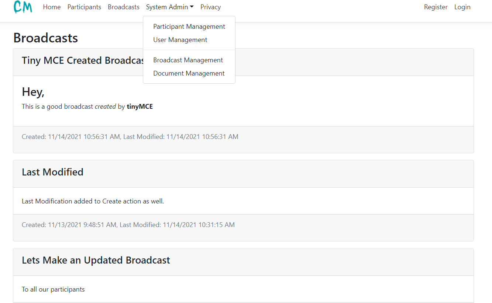

# dotnet-comorg (Communication for Organizations)

This is a template app an organization who owns a central system (api, payment systems etc.) with participants can use to communicate its participants.

Participants can manage their staff who need to access to all kind of resources with different roles and permissions in the app.

This app implements a custom ApplicationUser model extended from IdentityUser class provided by ASP.NET Identity. 

This app requires .NET 5